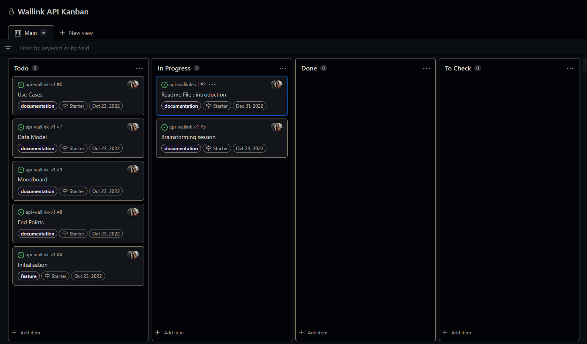
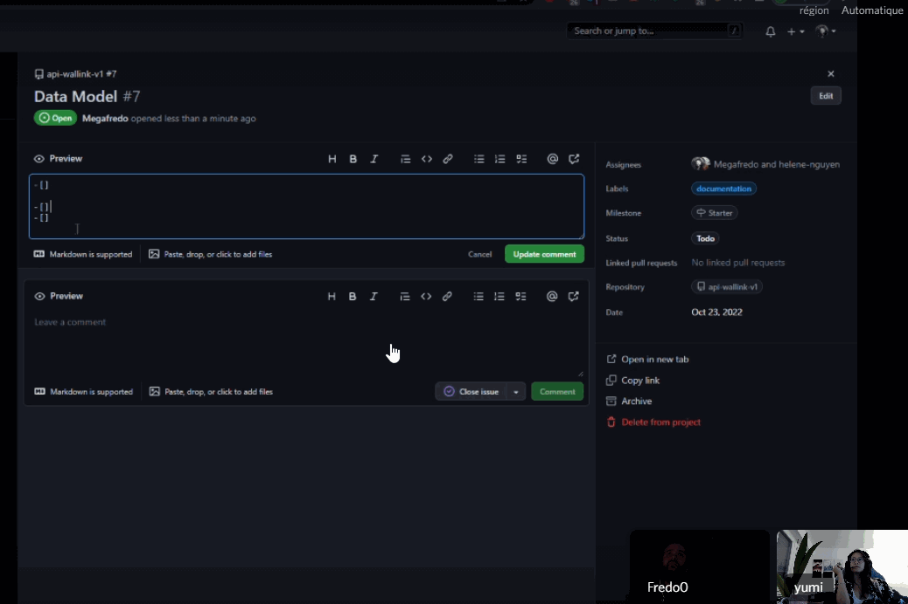
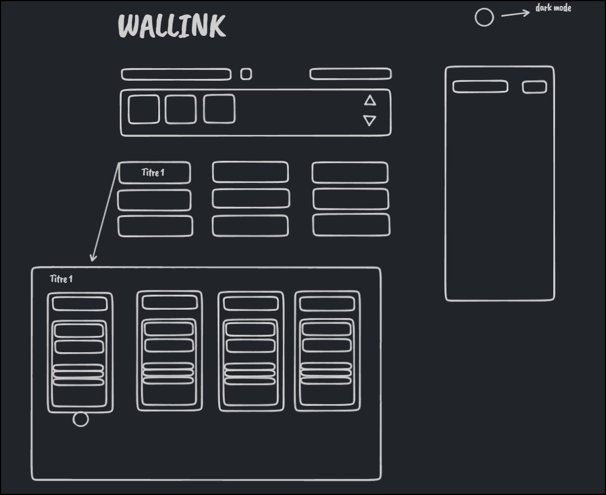

# Brainstorming

The main idea is to book each favorite URL from any website.

- Add a place for favorite folders
- User can drag and drop
- Easy to use
- Easy copy paste + add links
- Have a big wall of links

## Kanban preparation with Github project

To follow our project, we decided to apply agile method using the Kanban from GitHub project.

---

## Brainstorming

When we start a project, the most important thing is to be able to create something together.

The brainstorming helps us to share ideas, point of view, how the team imagine the project.

How we can use the app ? Everything we think about, we draw it !

And here we are ! After 1 hour of talking and drawing on [tl;draw](https://www.tldraw.com/), we finally have a pretty piece of our project.

---

[Previous](./00-summary.md) | [Home](../README.md) | [Next](./02-usecases.md)
